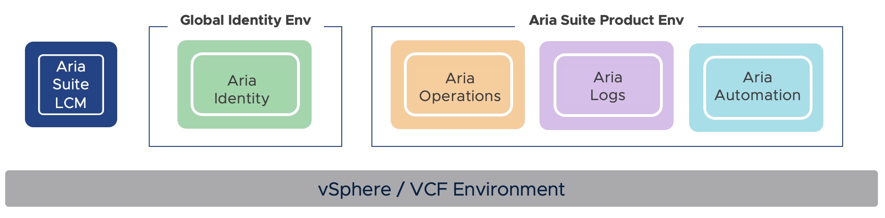
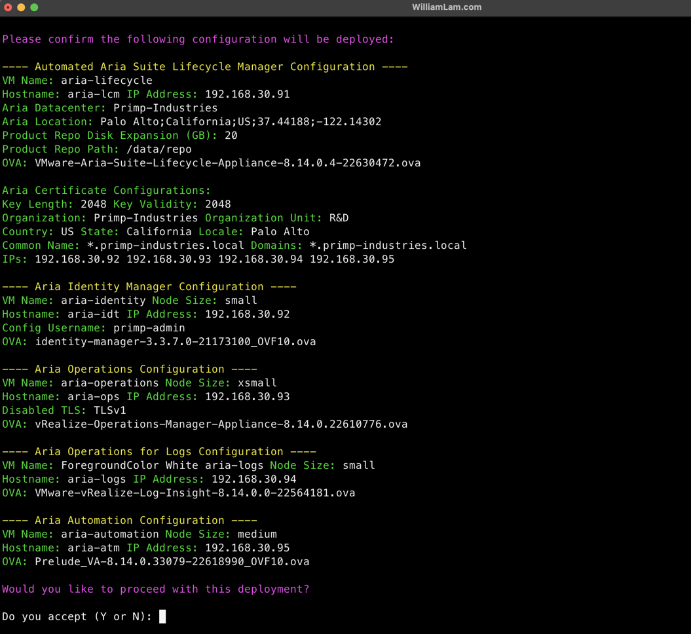
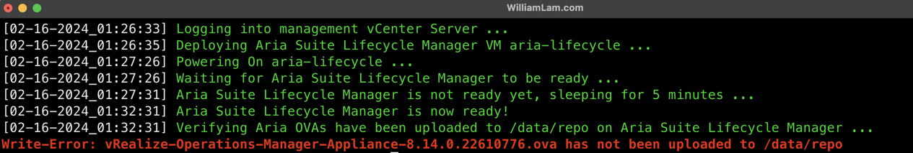
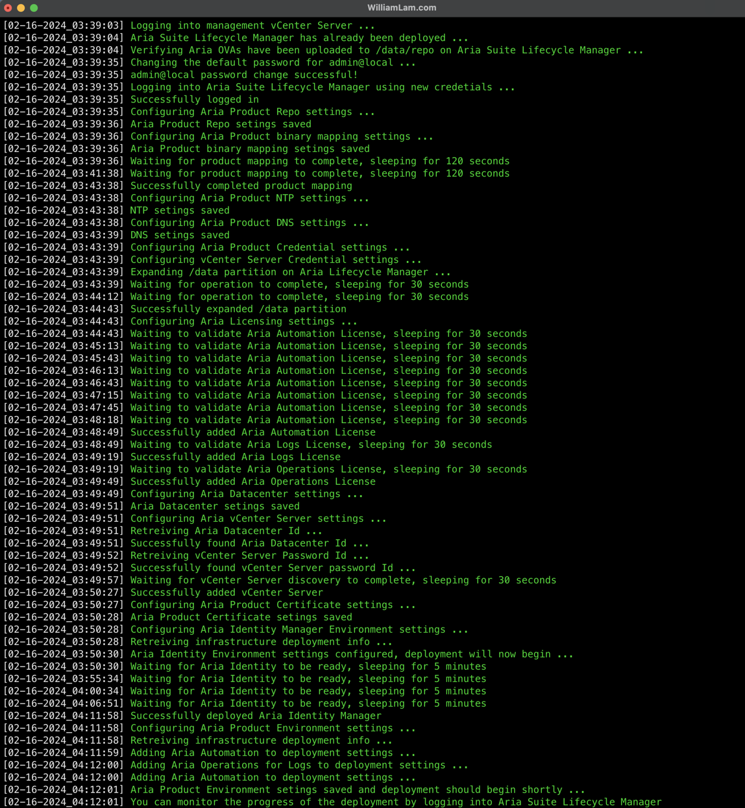
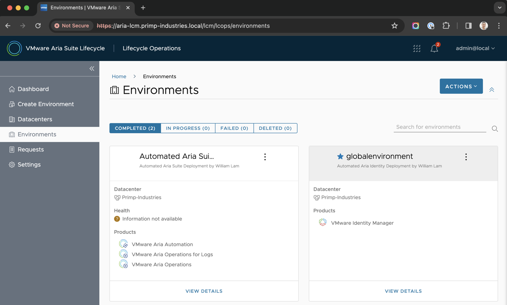

# Automated Aria Suite Lab Deployment

## Table of Contents

* [Description](#description)
* [Changelog](#changelog)
* [Requirements](#requirements)
* [Configuration](#configuration)
* [Logging](#logging)
* [Sample Execution](#sample-execution)

## Description

Similar to previous "Automated Lab Deployment Scripts" (such as [here](https://williamlam.com/2024/01/automated-lab-deployment-script-updated-to-support-vmware-cloud-foundation-vcf-5-1.html), [here](https://williamlam.com/2022/10/automated-vsphere-vsan-8-lab-deployment-script.html), [here](https://www.williamlam.com/2017/10/vghetto-automated-nsx-t-2-0-lab-deployment.html), [here](https://www.williamlam.com/2018/06/vghetto-automated-pivotal-container-service-pks-lab-deployment.html), [here](https://www.williamlam.com/2020/04/automated-vsphere-7-and-vsphere-with-kubernetes-lab-deployment-script.html), [here](https://www.williamlam.com/2020/10/automated-vsphere-with-tanzu-lab-deployment-script.html) and [here](https://williamlam.com/2021/04/automated-lab-deployment-script-for-vsphere-with-tanzu-using-nsx-advanced-load-balancer-nsx-alb.html)), this script makes it very easy for anyone to deploy the full Aria Suite of products including  [Aria Suite Lifecycle Manager](https://www.vmware.com/products/aria-suite-lifecycle.html) (formally vRSLCM), Aria Identity, Aria Operations, Aria Operations for Logs and Aria Automation on top of an existing VMware Cloud Foundation (VCF) or vSphere-based environment for homelab purposes. While there may be other solutions in deploying Aria Suite LCM and the respective Aria Products, they may be deployed in "Clustered" mode, which can be a challenge for resource limited environments. Lastly, this was also an opportunity for me re-familiarize myself with Aria Suite LCM and getting hands on with the [Aria Suite LCM REST APIs](https://developer.vmware.com/apis/1736/)!

Below is a diagram of what is deployed as part of this solution and you will need to have an existing vSphere environment running that is managed by vCenter Server and with enough resources (CPU, Memory and Storage) to deploy the various Aria products. Please see the [Sample Execution](#sample-execution) section below for an example on how the script works.



## Changelog

* 03/03/2024 - Add support for Aria LCM 8.16

## Requirements

* vCenter Server running at least vSphere 7.0 or later
    * Resources:
        * Ability to provision VMs with up to 12 vCPU
        * Ability to provision a minimum of 82GB of total memory
        * Ability to provision up to 1.26TB of total storage
* Latest PowerShell Core and PowerCLI release installed
* Aria licenses for Aria Operations, Aria Operations for Logs and/or Aria Automation
* Aria Suite LCM 8.16 or 8.14 OVAs pre-downloaded (see the table below for the exact versions)

| Function        | OVA Appliance                                               | Appliance Size | vCPU | Memory | Storage |
|-----------------|-------------------------------------------------------------|----------------|------|--------|---------|
| Aria Lifecycle  | [VMware-Aria-Suite-Lifecycle-Appliance-8.16.0.4-23377566.ova](https://customerconnect.vmware.com/downloads/details?downloadGroup=SUITELIFECYCLE816&productId=938&rPId=115633) or [VMware-Aria-Suite-Lifecycle-Appliance-8.14.0.4-22630472.ova](https://customerconnect.vmware.com/downloads/details?downloadGroup=SUITELIFECYCLE814&productId=938&rPId=115017) | N/A            | 2    | 8GB    | 117GB   |
| Aria Identity   | [identity-manager-3.3.7.0-21173100_OVF10.ova](https://customerconnect.vmware.com/downloads/details?downloadGroup=VIDM_ONPREM_3370&productId=938&rPId=115020)                 | small          | 6    | 10GB   | 100GB   |
| Aria Logs       | [VMware-vRealize-Log-Insight-8.16.0.0-23364779.ova](https://customerconnect.vmware.com/downloads/details?downloadGroup=OPLOGS-8160&productId=938&rPId=115633) or [VMware-vRealize-Log-Insight-8.14.0.0-22564181.ova](https://customerconnect.vmware.com/downloads/details?downloadGroup=OPLOGS-8140&productId=938&rPId=115018)           | small          | 4    | 8GB    | 530GB   |
| Aria Operations | [vRealize-Operations-Manager-Appliance-8.16.1.23365475.ova](https://customerconnect.vmware.com/downloads/details?downloadGroup=OPERATIONS-8161&productId=938&rPId=115633) or [vRealize-Operations-Manager-Appliance-8.14.0.22610776.ova](https://customerconnect.vmware.com/downloads/details?downloadGroup=OPERATIONS-8140&productId=938&rPId=115018)   | xsmall         | 2    | 8GB    | 274GB   |
| Aria Automation | [Prelude_VA-8.16.1.34314-23373968_OVF10.ova](https://customerconnect.vmware.com/downloads/details?downloadGroup=AUTOMATION-8161&productId=938&rPId=115633) or [Prelude_VA-8.14.0.33079-22618990_OVF10.ov](https://customerconnect.vmware.com/downloads/details?downloadGroup=AUTOMATION-8160&productId=938&rPId=115018)                  | medium         | 12   | 48GB   | 246GB   |

## Configuration

Before you can run the script, you will need to edit the script and update a number of variables to match your deployment environment. Details on each section is described below including actual values used in my home lab environment.

This section describes the vCenter Server endpoint and credentials that will be used to deploy Aria Suite LCM and respective Aria products.
```console
$vCenterServerFQDN = "FILL_ME_IN"
$vCenterUsername = "FILL_ME_IN"
$vCenterPassword = "FILL_ME_IN"
```

This section describes the vCenter Server configurations that will be used to deploy Aria Suite LCM and respective Aria products. Ensure resources like VM Folder and Resource Pool have already been pre-created before running the script.
```console
$VMDatacenter = "Primp-Datacenter"
$VMFolder = "Workloads"
$VMCluster = "Supermicro-Cluster"
$VMResourePool = "Workload"
$VMNetwork = "VM Network"
$VMDatastore = "sm-vsanDatastore"
$VMNetmask = "255.255.255.0"
$VMGateway = "192.168.30.1"
$VMDNS = "192.168.30.2"
$VMNTP = "pool.ntp.org"
$VMDomain = "primp-industries.local"
```

This section describes the configurations and location of the Aria Suite LCM OVA, which you must extract from the Aria Suite LCM ISO and will be deployed by the automation.
```console
$AriaSuiteLifecycleVMName = "aria-lifecycle"
$AriaSuiteLifecycleHostname = "aria-lcm"
$AriaSuiteLifecycleIP = "192.168.30.91"
$AriaSuiteLifecycleRootPassword = "VMware1!"
$AriaSuiteLifecycleAdminPassword = "VMware1!"
$AriaSuiteLifecycleOVA = "/Volumes/Storage/Software/VMware-Aria-Suite-Lifecycle-Installer-22630473/vrlcm/VMware-Aria-Suite-Lifecycle-Appliance-8.14.0.4-22630472.ova"
```

This section describes the Aria LCM repo configurations including the additional capacity that is required to deploy the full Aria suite of products along with the OVAs that will be validated as part of the binary mapping process. If you do not wish to deploy a specific Aria product, you can set the variable with an empty string using `""` which the automation will ignore checking for that particular OVA and will not deploy that particular Aria product.
```console
$diskExpansionInGB = 20
$AriaProductRepoPath = "/data/repo"
$AriaIdentityOVAFilename = "identity-manager-3.3.7.0-21173100_OVF10.ova"
$AriaOperationsOVAFilename = "vRealize-Operations-Manager-Appliance-8.14.0.22610776.ova"
$AriaLogsOVAFilename = "VMware-vRealize-Log-Insight-8.14.0.0-22564181.ova"
$AriaAutomationOVAFilename = "Prelude_VA-8.14.0.33079-22618990_OVF10.ova"
```

**Note:** With the exception of the Aria Suite LCM OVA, the rest of these OVA will need to be manually SCP'ed to the deployed Aria Suite LCM after the initial deployment and configuration. They should be uploaded to `/data/repo` which is automatically created for you as part of the automation. More details can be found in the example execution below.

This section describes the Aria licenses and alias names for each of the three Aria products. If you do not wish to deploy a specific Aria product, ensure the license key variable has an empty string `""` (default) and ensure that the OVA variable  also has an empty string. If you do intend to deploy specific Aria products, you will need to provide a valid license key.
```console
$AriaOperationsLicenseKey = ""
$AriaOperationsLicenseAlias = "Aria Operations License"
$AriaLogsLicenseKey = ""
$AriaLogsLicenseAlias = "Aria Logs License"
$AriaAutomationLicenseKey = ""
$AriaAutomationLicenseAlias = "Aria Automation License"
```

This section describes Aria credentials that will be saved in the Aria password locker. The automation assumes a single credential will be used across all Aria products for simplicity purpose. You can certainly augment the script to create individual Aria product specific credentials but that will require additional changes to script.
```console
$vCenterCredentialAlias = "vCenter Server Credentials"
$AriaProductCredentialAlias = "Aria Default Credentials"
$AriaProductDefaultUserName = "admin"
$AriaProductDefaultPassword = "VMware1!"
```

This section describes the Aria Datacenter configuration which includes the location which has format shown in example below.
```console
$AriaDatacenterName = "Primp-Industries"
$AriaDatacenterLocation = "Palo Alto;California;US;37.44188;-122.14302"
```

This section describes the Aria TLS self-sign certificate that will be managed by Aria Suite LCM and for the CN, Domain and IP it should contain a wildcard entry for a valid DNS domain within your environment and ensure all IP Addresses for various Aria products are included in the array as shown in example below.
```console
$AriaProductCertificateAlias = "Aria Certificates"
$AriaProductCertificateCN = "*.primp-industries.local"
$AriaProductCertificateOrganization = "Primp-Industries"
$AriaProductCertificateOU = "R&D"
$AriaProductCertificateCountry = "US"
$AriaProductCertificateLocale = "Palo Alto"
$AriaProductCertificateState = "California"
$AriaProductCertificateKeyLength = 2048
$AriaProductCertificateKeyValidity = 2048
$AriaProductCertificateDomain = @("*.primp-industries.local")
$AriaProductCertificateIP = @("192.168.30.92","192.168.30.93","192.168.30.94","192.168.30.95")
```

This section describes the Aria Identity configurations, please ensure that your DNS is fully resolvable based on the configurations set below.
```console
$AriaIdentityVMName = "aria-identity"
$AriaIdentityHostname = "aria-idt"
$AriaIdentityIP = "192.168.30.92"
$AriaIdentityNodeSize = "medium" # medium for use w/Aria Automation
$AriaIdentityConfigUsername = "primp-admin"
$AriaIdentityConfigEmail = "primp-admin@primp-industries.local"
```

This section describes the Aria Operations configurations, please ensure that your DNS is fully resolvable based on the configurations set below.
```console
$AriaOperationsVMName = "aria-operations"
$AriaOperationsHostname = "aria-ops"
$AriaOperationsIP = "192.168.30.93"
$AriaOperationsNodeSize = "xsmall" # xsmall, small, medium, large or xlarge
$AriaOperationsDisableTLS = "TLSv1" # TLSv1, TLSv1.1 or TLSv1,TLSv1.1
```

This section describes the Aria Operations for Logs configurations, please ensure that your DNS is fully resolvable based on the configurations set below.
```console
$AriaLogsVMName = "aria-logs"
$AriaLogsHostname = "aria-logs"
$AriaLogsIP = "192.168.30.94"
$AriaLogsNodeSize = "small" # small or medium
```

This section describes the Aria Automation configurations, please ensure that your DNS is fully resolvable based on the configurations set below.
```console
$AriaAutomationVMName = "aria-automation"
$AriaAutomationHostname = "aria-atm"
$AriaAutomationIP = "192.168.30.95"
$AriaAutomationNodeSize = "medium" # medium or xlarge
```

This section describes whether to enable verbose debugging, which will log all API URI, methods and payload into the log file, which can be useful for troubleshooting purposes or understanding the specific Aria Suite LCM APIs being used for a given operation.
```
$debug = $true
```

## Logging

There is additional verbose logging that outputs as a log file in your current working directory **aria-suite-deployment.log**

## Sample Execution

In the example below, I am deploying the full Aria suite with the following DNS and IP configurations:

| Function        | VMName          | Hostname  | FQDN                             | IP Address    |
|-----------------|-----------------|-----------|----------------------------------|---------------|
| Aria Lifecycle  | aria-lifecycle  | aria-lcm  | aria-lcm.primp-industries.local  | 192.168.30.91 |
| Aria Identity   | aria-identity   | aria-idt  | aria-idt.primp-industries.local  | 192.168.30.92 |
| Aria Logs       | aria-logs       | aria-logs | aria-logs.primp-industries.local | 192.168.30.93 |
| Aria Operations | aria-operations | aria-ops  | .primp-industries.local          | 192.168.30.94 |
| Aria Automation | aria-automation | aria-atm  | aria-atm.primp-industries.local  | 192.168.30.95 |

Before the script runs, it will prompt for confirmation and you can verify that everything looks accurate before starting.



The automation is broken up into two phases:

**Phase 1** - The script will deploy the Aria Suite LCM appliance, change the default `admin@local` password to the one you had defined in the script and it will automatically create the product repo directory (default: `/data/repo`) based on your configuration. It will then look at the configured OVA variables in the script to determine which of the Aria products (Identity, Operations, Logs and/or Automation) you wish intend to deploy. It will then stop (by design), since the OVAs are not in `/data/repo` directory as you can see from the screenshot below. You will then need to manually SCP (using root) the desired OVAs and then re-run the script when that process has completed.



**Phase 2** - The next time you run the script, it will check whether the Aria Suite LCM appliance has already been deployed and skip that step and re-check whether the correct OVAs have been uploaded to the product repo directory (default: `/data/repo`). If it is able to list those files, it will assume that they have been uploaded successfully and the second phase of the script will now begin with the remainder of the configurations for Aria Suite LCM. If you are deploying Aria Automation (requires Aria Identity), it will first create the Global Environment where Aria Identity will be configured and thenit will deploy the remainder Aria products into a separate Aria Environment based on your configured variables.



Once the Aria product environment has been successfully created, you can monitor the progress of the deployment by logging into the Aria Suite LCM UI. In my example, I have deployed the full Aria product and you should find two environments configured and you can now login to each of the Aria products.

